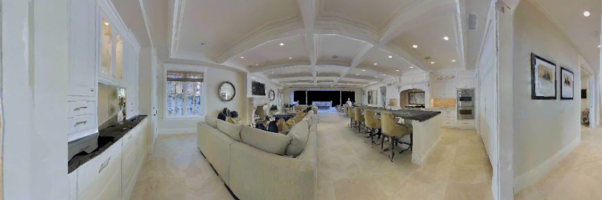

# MVSD: Mutual Learning for Acoustic Matching and Dereverberation via Visual Scene-driven Diffusion
Audio style transfer under visual guidance has been made significant progress with the emergence of cross-modal generation. Nevertheless, simultaneously recording large-scale audio pairs at both the source and receiving ends presents a formidable challenge.
What makes matters worse, existing methods treat each task independently, overlooking the inverse correlation between some dual tasks, which hinders the ability to leverage massive unlabeled data. In this paper, we introduce MVSD, a diffusion model-based mutual learning mechanism. MVSD exploits the intrinsic reciprocity between *visual acoustic matching (VAM)* and *dereverberation*, enabling learning from symmetric tasks and overcome the scarcity of data. More specifically, MVSD employs two converters: one for VAM called reverberator and another for dereverberation called dereverberator. The dereverberator judges whether the reverberation audio generated by reverberator sounds like being in the conditional visual scenario, and vice versa.
By forming a closed loop, these two converters can generate informative feedback signals which can optimize the inverse tasks, even with easily acquired one-way unpaired data. Furthermore, we employ the diffusion model as foundational conditional generators to circumvent the training instability and over-smoothing drawbacks of conventional GAN architectures. Extensive experiments exhibit that our framework can improve the performance of each task and better match specified visual scenarios.
In both tasks, MVSD surpasses competitors on two standard benchmarks. Remarkably, the performance of the models can be further enhanced by adding unpaired data.

<!--

-->

# Visual Acoustic Matching (VAM)

<audio src="./samples/ss_reverb/source_3729-6852-0033_0.0290.wav" controls></audio> Source
[Play Audio](./samples/ss_reverb/source_3729-6852-0033_0.0290.wav)
[GT](./samples/ss_reverb/gt_3729-6852-0033_0.0290.wav)
[Image2Reverb](./samples/ss_reverb/image2reverb/img2reverb_reverb_source_3729-6852-0033_0.0290.wav)
[Avatir](./samples/ss_reverb/image2reverb/img2reverb_reverb_source_3729-6852-0033_0.0290.wav)
[MVSD](./samples/ss_reverb/avatir/avitar_reverb_source_3729-6852-0033_0.0290.wav)

<!--

    
    <audio src="https://github.com/MVSD-audios/MVSD/blob/demo-pages/samples/ss_reverb/source_3729-6852-0033_0.0290.wav" controls></audio> Source
    <audio src="https://github.com/MVSD-audios/MVSD/blob/demo-pages/samples/ss_reverb/gt_3729-6852-0033_0.0290.wav" controls></audio> GT
    <audio src="https://github.com/MVSD-audios/MVSD/blob/demo-pages/samples/ss_reverb/image2reverb/img2reverb_reverb_source_3729-6852-0033_0.0290.wav" controls></audio> Image2Reverb
    <audio src="https://github.com/MVSD-audios/MVSD/blob/demo-pages/samples/ss_reverb/avatir/avitar_reverb_source_3729-6852-0033_0.0290.wav" controls></audio> Avatir
    <audio src="https://github.com/MVSD-audios/MVSD/blob/demo-pages/samples/ss_reverb/3729-6852-0033_0.0290.wav" controls></audio> MVSD

-->
<!--
## 1. VCTK Corpus
VCTK Corpus contains approximately 44 hours of speech recordings from 109 speakers with various accents. These sentences are selected from multiple media or archives. Each speaker reads out about 400 sentences selected by the greedy algorithm. VCTK Corpus contains 47 male speakers and 62 female speakers, with a relatively balanced gender ratio.

### 1.1 Female to Female

<table>
    <tr>
    	<td></td>
    	<td> Sample 1 (p233 → p236) </td>
    	<td> Sample 2 (p239 → p244) </td>
    </tr>
    <tr>
    	<td>Source</td>
    	<td><audio id="audio" controls="" preload="none">
      		<source id="wav" src="https://github.com/hechang25/SGAN-VC/raw/gh-pages/samples/p233_316_mic1_to_p236_298_mic2/source_p233_316_mic1.wav">
		</audio>
		</td>
    	<td><audio id="audio" controls="" preload="none">
      		<source id="wav" src="https://github.com/hechang25/SGAN-VC/raw/gh-pages/samples/p239_455_mic2_to_p244_400_mic1/source_p239_455_mic2.wav">
		</audio>
	    </td>
    </tr>
    <tr>
    	<td>Target</td>
    	<td><audio id="audio" controls="" preload="none">
      		<source id="wav" src="https://github.com/hechang25/SGAN-VC/raw/gh-pages/samples/p233_316_mic1_to_p236_298_mic2/target_p236_298_mic2.wav">
		</audio>
	 	</td>
    	<td><audio id="audio" controls="" preload="none">
      		<source id="wav" src="https://github.com/hechang25/SGAN-VC/raw/gh-pages/samples/p239_455_mic2_to_p244_400_mic1/target_p244_400_mic1.wav">
		</audio>
	    </td>
    </tr>
    <tr>
    	<td>StarGANv2-VC-noASR</td>
    	<td><audio id="audio" controls="" preload="none">
      		<source id="wav" src="https://github.com/hechang25/SGAN-VC/raw/gh-pages/samples/p233_316_mic1_to_p236_298_mic2/starganv2-vc-noasr_p233_316_mic1_to_p236_298_mic2.wav">
		</audio>
	    </td>
    	<td><audio id="audio" controls="" preload="none">
      		<source id="wav" src="https://github.com/hechang25/SGAN-VC/raw/gh-pages/samples/p239_455_mic2_to_p244_400_mic1/starganv2-vc-noasr_p239_455_mic2_to_p244_400_mic1.wav">
		</audio>
	    </td>
    </tr>
    <tr>
    	<td>StarGANv2-VC-ASR</td>
    	<td><audio id="audio" controls="" preload="none">
      		<source id="wav" src="https://github.com/hechang25/SGAN-VC/raw/gh-pages/samples/p233_316_mic1_to_p236_298_mic2/starganv2-vc-asr_p233_316_mic1_to_p236_298_mic2.wav">
		</audio>
	    </td>
    	<td><audio id="audio" controls="" preload="none">
      		<source id="wav" src="https://github.com/hechang25/SGAN-VC/raw/gh-pages/samples/p239_455_mic2_to_p244_400_mic1/starganv2-vc-asr_p239_455_mic2_to_p244_400_mic1.wav">
		</audio>
	    </td>
    </tr>
	<tr>
    	<td>SGAN-VC-Unseen</td>
    	<td><audio id="audio" controls="" preload="none">
      		<source id="wav" src="https://github.com/hechang25/SGAN-VC/raw/gh-pages/samples/p233_316_mic1_to_p236_298_mic2/sganvc_unseen_p233_316_mic1_to_p236_298_mic2.wav">
		</audio>
	    </td>
    	<td><audio id="audio" controls="" preload="none">
      		<source id="wav" src="https://github.com/hechang25/SGAN-VC/raw/gh-pages/samples/p239_455_mic2_to_p244_400_mic1/sganvc_unseen_p239_455_mic2_to_p244_400_mic1.wav">
		</audio>
	    </td>
    </tr>
	<tr>
    	<td>SGAN-VC-Seen</td>
    	<td><audio id="audio" controls="" preload="none">
      		<source id="wav" src="https://github.com/hechang25/SGAN-VC/raw/gh-pages/samples/p233_316_mic1_to_p236_298_mic2/sganvc_seen_p233_316_mic1_to_p236_298_mic2.wav">
		</audio>
	    </td>
    	<td><audio id="audio" controls="" preload="none">
      		<source id="wav" src="https://github.com/hechang25/SGAN-VC/raw/gh-pages/samples/p239_455_mic2_to_p244_400_mic1/sganvc_seen_p239_455_mic2_to_p244_400_mic1.wav">
		</audio>
	    </td>
    </tr>
</table>

### 1.2 Female to Male

<table>
    <tr>
    	<td></td>
    	<td> Sample 1 (p233 → p254) </td>
    	<td> Sample 2 (p236 → p259) </td>
    </tr>
    <tr>
    	<td>Source</td>
    	<td><audio id="audio" controls="" preload="none">
      		<source id="wav" src="https://github.com/hechang25/SGAN-VC/raw/gh-pages/samples/p233_254_mic1_to_p254_165_mic2/source_p233_254_mic1.wav">
		</audio>
		</td>
    	<td><audio id="audio" controls="" preload="none">
      		<source id="wav" src="https://github.com/hechang25/SGAN-VC/raw/gh-pages/samples/p236_201_mic2_to_p259_468_mic1/source_p236_201_mic2.wav">
		</audio>
	    </td>
    </tr>
    <tr>
    	<td>Target</td>
    	<td><audio id="audio" controls="" preload="none">
      		<source id="wav" src="https://github.com/hechang25/SGAN-VC/raw/gh-pages/samples/p233_254_mic1_to_p254_165_mic2/target_p254_165_mic2.wav">
		</audio>
	 	</td>
    	<td><audio id="audio" controls="" preload="none">
      		<source id="wav" src="https://github.com/hechang25/SGAN-VC/raw/gh-pages/samples/p236_201_mic2_to_p259_468_mic1/target_p259_468_mic1.wav">
		</audio>
	    </td>
    </tr>
    <tr>
    	<td>StarGANv2-VC-noASR</td>
    	<td><audio id="audio" controls="" preload="none">
      		<source id="wav" src="https://github.com/hechang25/SGAN-VC/raw/gh-pages/samples/p233_254_mic1_to_p254_165_mic2/starganv2-vc-noasr_p233_254_mic1_to_p254_165_mic2.wav">
		</audio>
	    </td>
    	<td><audio id="audio" controls="" preload="none">
      		<source id="wav" src="https://github.com/hechang25/SGAN-VC/raw/gh-pages/samples/p236_201_mic2_to_p259_468_mic1/starganv2-vc-noasr_p236_201_mic2_to_p259_468_mic1.wav">
		</audio>
	    </td>
    </tr>
	<tr>
    	<td>StarGANv2-VC-ASR</td>
    	<td><audio id="audio" controls="" preload="none">
      		<source id="wav" src="https://github.com/hechang25/SGAN-VC/raw/gh-pages/samples/p233_254_mic1_to_p254_165_mic2/starganv2-vc-asr_p233_254_mic1_to_p254_165_mic2.wav">
		</audio>
	    </td>
    	<td><audio id="audio" controls="" preload="none">
      		<source id="wav" src="https://github.com/hechang25/SGAN-VC/raw/gh-pages/samples/p236_201_mic2_to_p259_468_mic1/starganv2-vc-asr_p236_201_mic2_to_p259_468_mic1.wav">
		</audio>
	    </td>
	</tr>
	<tr>
    	<td>SGAN-VC-Unseen</td>
    	<td><audio id="audio" controls="" preload="none">
      		<source id="wav" src="https://github.com/hechang25/SGAN-VC/raw/gh-pages/samples/p233_254_mic1_to_p254_165_mic2/sganvc_unseen_p233_254_mic1_to_p254_165_mic2.wav">
		</audio>
	    </td>
    	<td><audio id="audio" controls="" preload="none">
      		<source id="wav" src="https://github.com/hechang25/SGAN-VC/raw/gh-pages/samples/p236_201_mic2_to_p259_468_mic1/sganvc_unseen_p236_201_mic2_to_p259_468_mic1.wav">
		</audio>
	    </td>
	</tr>
	<tr>
    	<td>SGAN-VC-Seen</td>
    	<td><audio id="audio" controls="" preload="none">
      		<source id="wav" src="https://github.com/hechang25/SGAN-VC/raw/gh-pages/samples/p233_254_mic1_to_p254_165_mic2/sganvc_seen_p233_254_mic1_to_p254_165_mic2.wav">
		</audio>
	    </td>
    	<td><audio id="audio" controls="" preload="none">
      		<source id="wav" src="https://github.com/hechang25/SGAN-VC/raw/gh-pages/samples/p236_201_mic2_to_p259_468_mic1/sganvc_seen_p236_201_mic2_to_p259_468_mic1.wav">
		</audio>
	    </td>
	</tr>  
</table>

### 1.3 Male to Female

<table>
    <tr>
    	<td></td>
    	<td> Sample 1 (p258 → p236) </td>
    	<td> Sample 2 (p259 → p239) </td>
    </tr>
    <tr>
    	<td>Source</td>
    	<td><audio id="audio" controls="" preload="none">
      		<source id="wav" src="https://github.com/hechang25/SGAN-VC/raw/gh-pages/samples/p258_332_mic2_to_p236_402_mic2/source_p258_332_mic2.wav">
		</audio>
		</td>
    	<td><audio id="audio" controls="" preload="none">
      		<source id="wav" src="https://github.com/hechang25/SGAN-VC/raw/gh-pages/samples/p259_090_mic2_to_p239_409_mic1/source_p259_090_mic2.wav">
		</audio>
	    </td>
    </tr>
    <tr>
    	<td>Target</td>
    	<td><audio id="audio" controls="" preload="none">
      		<source id="wav" src="https://github.com/hechang25/SGAN-VC/raw/gh-pages/samples/p258_332_mic2_to_p236_402_mic2/target_p236_402_mic2.wav">
		</audio>
	 	</td>
    	<td><audio id="audio" controls="" preload="none">
      		<source id="wav" src="https://github.com/hechang25/SGAN-VC/raw/gh-pages/samples/p259_090_mic2_to_p239_409_mic1/target_p239_409_mic1.wav">
		</audio>
	    </td>
    </tr>
    <tr>
    	<td>StarGANv2-VC-noASR</td>
    	<td><audio id="audio" controls="" preload="none">
      		<source id="wav" src="https://github.com/hechang25/SGAN-VC/raw/gh-pages/samples/p258_332_mic2_to_p236_402_mic2/starganv2-vc-noasr_p258_332_mic2_to_p236_402_mic2.wav">
		</audio>
	    </td>
    	<td><audio id="audio" controls="" preload="none">
      		<source id="wav" src="https://github.com/hechang25/SGAN-VC/raw/gh-pages/samples/p259_090_mic2_to_p239_409_mic1/starganv2-vc-noasr_p259_090_mic2_to_p239_409_mic1.wav">
		</audio>
	    </td>
    </tr>
    <tr>
    	<td>StarGANv2-VC-ASR</td>
    	<td><audio id="audio" controls="" preload="none">
      		<source id="wav" src="https://github.com/hechang25/SGAN-VC/raw/gh-pages/samples/p258_332_mic2_to_p236_402_mic2/starganv2-vc-asr_p258_332_mic2_to_p236_402_mic2.wav">
		</audio>
	    </td>
    	<td><audio id="audio" controls="" preload="none">
      		<source id="wav" src="https://github.com/hechang25/SGAN-VC/raw/gh-pages/samples/p259_090_mic2_to_p239_409_mic1/starganv2-vc-asr_p259_090_mic2_to_p239_409_mic1.wav">
		</audio>
	    </td>
    </tr>
    <tr>
    	<td>SGAN-VC-Unseen</td>
    	<td><audio id="audio" controls="" preload="none">
      		<source id="wav" src="https://github.com/hechang25/SGAN-VC/raw/gh-pages/samples/p258_332_mic2_to_p236_402_mic2/sganvc_unseen_p258_332_mic2_to_p236_402_mic2.wav">
		</audio>
	    </td>
    	<td><audio id="audio" controls="" preload="none">
      		<source id="wav" src="https://github.com/hechang25/SGAN-VC/raw/gh-pages/samples/p259_090_mic2_to_p239_409_mic1/sganvc_unseen_p259_090_mic2_to_p239_409_mic1.wav">
		</audio>
	    </td>
    </tr>
    <tr>
    	<td>SGAN-VC-Seen</td>
    	<td><audio id="audio" controls="" preload="none">
      		<source id="wav" src="https://github.com/hechang25/SGAN-VC/raw/gh-pages/samples/p258_332_mic2_to_p236_402_mic2/sganvc_seen_p258_332_mic2_to_p236_402_mic2.wav">
		</audio>
	    </td>
    	<td><audio id="audio" controls="" preload="none">
      		<source id="wav" src="https://github.com/hechang25/SGAN-VC/raw/gh-pages/samples/p259_090_mic2_to_p239_409_mic1/sganvc_seen_p259_090_mic2_to_p239_409_mic1.wav">
		</audio>
	    </td>
    </tr>  
</table>

### 1.4 Male to Male

<table>
    <tr>
    	<td></td>
    	<td> Sample 1 (p258 → p254) </td>
    	<td> Sample 2 (p270 → p258) </td>
    </tr>
    <tr>
    	<td>Source</td>
    	<td><audio id="audio" controls="" preload="none">
      		<source id="wav" src="https://github.com/hechang25/SGAN-VC/raw/gh-pages/samples/p258_159_mic1_to_p254_064_mic1/source_p258_159_mic1.wav">
		</audio>
		</td>
    	<td><audio id="audio" controls="" preload="none">
      		<source id="wav" src="https://github.com/hechang25/SGAN-VC/raw/gh-pages/samples/p270_062_mic1_to_p258_308_mic1/source_p270_062_mic1.wav">
		</audio>
	    </td>
    </tr>
    <tr>
    	<td>Target</td>
    	<td><audio id="audio" controls="" preload="none">
      		<source id="wav" src="https://github.com/hechang25/SGAN-VC/raw/gh-pages/samples/p258_159_mic1_to_p254_064_mic1/target_p254_064_mic1.wav">
		</audio>
	 	</td>
    	<td><audio id="audio" controls="" preload="none">
      		<source id="wav" src="https://github.com/hechang25/SGAN-VC/raw/gh-pages/samples/p270_062_mic1_to_p258_308_mic1/target_p258_308_mic1.wav">
		</audio>
	    </td>
    </tr>
    <tr>
    	<td>StarGANv2-VC-noASR</td>
    	<td><audio id="audio" controls="" preload="none">
      		<source id="wav" src="https://github.com/hechang25/SGAN-VC/raw/gh-pages/samples/p258_159_mic1_to_p254_064_mic1/starganv2-vc-noasr_p258_159_mic1_to_p254_064_mic1.wav">
		</audio>
	    </td>
    	<td><audio id="audio" controls="" preload="none">
      		<source id="wav" src="https://github.com/hechang25/SGAN-VC/raw/gh-pages/samples/p270_062_mic1_to_p258_308_mic1/starganv2-vc-noasr_p270_062_mic1_to_p258_308_mic1.wav">
		</audio>
	    </td>
    </tr>
    <tr>
    	<td>StarGANv2-VC-ASR</td>
    	<td><audio id="audio" controls="" preload="none">
      		<source id="wav" src="https://github.com/hechang25/SGAN-VC/raw/gh-pages/samples/p258_159_mic1_to_p254_064_mic1/starganv2-vc-asr_p258_159_mic1_to_p254_064_mic1.wav">
		</audio>
	    </td>
    	<td><audio id="audio" controls="" preload="none">
      		<source id="wav" src="https://github.com/hechang25/SGAN-VC/raw/gh-pages/samples/p270_062_mic1_to_p258_308_mic1/starganv2-vc-asr_p270_062_mic1_to_p258_308_mic1.wav">
		</audio>
	    </td>
    </tr>
    <tr>
    	<td>SGAN-VC-Unseen</td>
    	<td><audio id="audio" controls="" preload="none">
      		<source id="wav" src="https://github.com/hechang25/SGAN-VC/raw/gh-pages/samples/p258_159_mic1_to_p254_064_mic1/sganvc_unseen_p258_159_mic1_to_p254_064_mic1.wav">
		</audio>
	    </td>
    	<td><audio id="audio" controls="" preload="none">
      		<source id="wav" src="https://github.com/hechang25/SGAN-VC/raw/gh-pages/samples/p270_062_mic1_to_p258_308_mic1/sganvc_unseen_p270_062_mic1_to_p258_308_mic1.wav">
		</audio>
	    </td>
    </tr>
    <tr>
    	<td>SGAN-VC-Seen</td>
    	<td><audio id="audio" controls="" preload="none">
      		<source id="wav" src="https://github.com/hechang25/SGAN-VC/raw/gh-pages/samples/p258_159_mic1_to_p254_064_mic1/sganvc_seen_p258_159_mic1_to_p254_064_mic1.wav">
		</audio>
	    </td>
    	<td><audio id="audio" controls="" preload="none">
      		<source id="wav" src="https://github.com/hechang25/SGAN-VC/raw/gh-pages/samples/p270_062_mic1_to_p258_308_mic1/sganvc_seen_p270_062_mic1_to_p258_308_mic1.wav">
		</audio>
	    </td>
    </tr>  
</table>

## 2. AISHELL3-84
**AISHELL3** is a large-scale and high-fidelity multi-speaker Mandarin speech corpus. 
The corpus contains roughly 85 hours of recordings produced by 218 native Chinese speakers (consisting of 176 female and 42 male) and a total of 88,035 utterances. Due to the unbalanced gender ratio of AISHELL3, we employ all-male speakers and a randomly selected array of 42 female speakers as our evaluation dataset, called **AISHELL3-84**. In **AISHELL3-84**, we randomly sample 5 males and 5 females as the final test set.

### 2.1 Female to Female
<table>
    <tr>
    	<td></td>
    	<td> Sample 1 (11 → 1000) </td>
    	<td> Sample 2 (482 → 11) </td>
    </tr>
    <tr>
    	<td>Source</td>
    	<td><audio id="audio" controls="" preload="none">
      		<source id="wav" src="https://github.com/hechang25/SGAN-VC/raw/gh-pages/samples/SSB00110136_to_SSB10000215/source-SSB00110136.wav">
		</audio>
		</td>
    	<td><audio id="audio" controls="" preload="none">
      		<source id="wav" src="https://github.com/hechang25/SGAN-VC/raw/gh-pages/samples/SSB04820030_to_SSB00110206/source-SSB04820030.wav">
		</audio>
	    </td>
    </tr>
    <tr>
    	<td>Target</td>
    	<td><audio id="audio" controls="" preload="none">
      		<source id="wav" src="https://github.com/hechang25/SGAN-VC/raw/gh-pages/samples/SSB00110136_to_SSB10000215/target-SSB10000215.wav">
		</audio>
	 	</td>
    	<td><audio id="audio" controls="" preload="none">
      		<source id="wav" src="https://github.com/hechang25/SGAN-VC/raw/gh-pages/samples/SSB04820030_to_SSB00110206/target-SSB00110206.wav">
		</audio>
	    </td>
    </tr>
    <tr>
    	<td>StarGANv2-VC-noASR</td>
    	<td><audio id="audio" controls="" preload="none">
      		<source id="wav" src="https://github.com/hechang25/SGAN-VC/raw/gh-pages/samples/SSB00110136_to_SSB10000215/starganv2-vc_noasr-SSB00110136_to_SSB10000215.wav">
		</audio>
	    </td>
    	<td><audio id="audio" controls="" preload="none">
      		<source id="wav" src="https://github.com/hechang25/SGAN-VC/raw/gh-pages/samples/SSB04820030_to_SSB00110206/starganv2-vc_noasr-SSB04820030_to_SSB00110206.wav">
		</audio>
	    </td>
    </tr>
    <tr>
    	<td>StarGANv2-VC-ASR</td>
    	<td><audio id="audio" controls="" preload="none">
      		<source id="wav" src="https://github.com/hechang25/SGAN-VC/raw/gh-pages/samples/SSB00110136_to_SSB10000215/starganv2-vc_asr-SSB00110136_to_SSB10000215.wav">
		</audio>
	    </td>
    	<td><audio id="audio" controls="" preload="none">
      		<source id="wav" src="https://github.com/hechang25/SGAN-VC/raw/gh-pages/samples/SSB04820030_to_SSB00110206/starganv2-vc_asr-SSB04820030_to_SSB00110206.wav">
		</audio>
	    </td>
    </tr>
    <tr>
    	<td>SGAN-VC-Unseen</td>
    	<td><audio id="audio" controls="" preload="none">
      		<source id="wav" src="https://github.com/hechang25/SGAN-VC/raw/gh-pages/samples/SSB00110136_to_SSB10000215/sganvc_unseen-SSB00110136_to_SSB10000215.wav">
		</audio>
	    </td>
    	<td><audio id="audio" controls="" preload="none">
      		<source id="wav" src="https://github.com/hechang25/SGAN-VC/raw/gh-pages/samples/SSB04820030_to_SSB00110206/sganvc_unseen-SSB04820030_to_SSB00110206.wav">
		</audio>
	    </td>
    </tr>
    <tr>
    	<td>SGAN-VC-Seen</td>
    	<td><audio id="audio" controls="" preload="none">
      		<source id="wav" src="https://github.com/hechang25/SGAN-VC/raw/gh-pages/samples/SSB00110136_to_SSB10000215/sganvc_seen-SSB00110136_to_SSB10000215.wav">
		</audio>
	    </td>
    	<td><audio id="audio" controls="" preload="none">
      		<source id="wav" src="https://github.com/hechang25/SGAN-VC/raw/gh-pages/samples/SSB04820030_to_SSB00110206/sganvc_seen-SSB04820030_to_SSB00110206.wav">
		</audio>
	    </td>
    </tr>  
</table>

### 2.2 Female to Male

<table>
    <tr>
    	<td></td>
    	<td> Sample 1 (1000 → 1365) </td>
    	<td> Sample 2 (1274 → 710) </td>
    </tr>
    <tr>
    	<td>Source</td>
    	<td><audio id="audio" controls="" preload="none">
      		<source id="wav" src="https://github.com/hechang25/SGAN-VC/raw/gh-pages/samples/SSB10000120_to_SSB13650054/source-SSB10000120.wav">
		</audio>
		</td>
    	<td><audio id="audio" controls="" preload="none">
      		<source id="wav" src="https://github.com/hechang25/SGAN-VC/raw/gh-pages/samples/SSB12740372_to_SSB07100189/source-SSB12740372.wav">
		</audio>
	    </td>
    </tr>
    <tr>
    	<td>Target</td>
    	<td><audio id="audio" controls="" preload="none">
      		<source id="wav" src="https://github.com/hechang25/SGAN-VC/raw/gh-pages/samples/SSB10000120_to_SSB13650054/target-SSB13650054.wav">
		</audio>
	 	</td>
    	<td><audio id="audio" controls="" preload="none">
      		<source id="wav" src="https://github.com/hechang25/SGAN-VC/raw/gh-pages/samples/SSB12740372_to_SSB07100189/target-SSB07100189.wav">
		</audio>
	    </td>
    </tr>
    <tr>
    	<td>StarGANv2-VC-noASR</td>
    	<td><audio id="audio" controls="" preload="none">
      		<source id="wav" src="https://github.com/hechang25/SGAN-VC/raw/gh-pages/samples/SSB10000120_to_SSB13650054/starganv2-vc_noasr-SSB10000120_to_SSB13650054.wav">
		</audio>
	    </td>
    	<td><audio id="audio" controls="" preload="none">
      		<source id="wav" src="https://github.com/hechang25/SGAN-VC/raw/gh-pages/samples/SSB12740372_to_SSB07100189/starganv2-vc_noasr-SSB12740372_to_SSB07100189.wav">
		</audio>
	    </td>
    </tr>
    <tr>
    	<td>StarGANv2-VC-ASR</td>
    	<td><audio id="audio" controls="" preload="none">
      		<source id="wav" src="https://github.com/hechang25/SGAN-VC/raw/gh-pages/samples/SSB10000120_to_SSB13650054/starganv2-vc_asr-SSB10000120_to_SSB13650054.wav">
		</audio>
	    </td>
    	<td><audio id="audio" controls="" preload="none">
      		<source id="wav" src="https://github.com/hechang25/SGAN-VC/raw/gh-pages/samples/SSB12740372_to_SSB07100189/starganv2-vc_asr-SSB12740372_to_SSB07100189.wav">
		</audio>
	    </td>
    </tr>
    <tr>
    	<td>SGAN-VC-Unseen</td>
    	<td><audio id="audio" controls="" preload="none">
      		<source id="wav" src="https://github.com/hechang25/SGAN-VC/raw/gh-pages/samples/SSB10000120_to_SSB13650054/sganvc_unseen-SSB10000120_to_SSB13650054.wav">
		</audio>
	    </td>
    	<td><audio id="audio" controls="" preload="none">
      		<source id="wav" src="https://github.com/hechang25/SGAN-VC/raw/gh-pages/samples/SSB12740372_to_SSB07100189/sganvc_unseen-SSB12740372_to_SSB07100189.wav">
		</audio>
	    </td>
    </tr>
    <tr>
    	<td>SGAN-VC-Seen</td>
    	<td><audio id="audio" controls="" preload="none">
      		<source id="wav" src="https://github.com/hechang25/SGAN-VC/raw/gh-pages/samples/SSB10000120_to_SSB13650054/sganvc_seen-SSB10000120_to_SSB13650054.wav">
		</audio>
	    </td>
    	<td><audio id="audio" controls="" preload="none">
      		<source id="wav" src="https://github.com/hechang25/SGAN-VC/raw/gh-pages/samples/SSB12740372_to_SSB07100189/sganvc_seen-SSB12740372_to_SSB07100189.wav">
		</audio>
	    </td>
    </tr>  
</table>

### 2.3 Male to Female

<table>
    <tr>
    	<td></td>
    	<td> Sample 1 (394 → 1274) </td>
    	<td> Sample 2 (407 → 1000) </td>
    </tr>
    <tr>
    	<td>Source</td>
    	<td><audio id="audio" controls="" preload="none">
      		<source id="wav" src="https://github.com/hechang25/SGAN-VC/raw/gh-pages/samples/SSB03940020_to_SSB12740393/source-SSB03940020.wav">
		</audio>
		</td>
    	<td><audio id="audio" controls="" preload="none">
      		<source id="wav" src="https://github.com/hechang25/SGAN-VC/raw/gh-pages/samples/SSB04070119_to_SSB10000238/source-SSB04070119.wav">
		</audio>
	    </td>
    </tr>
    <tr>
    	<td>Target</td>
    	<td><audio id="audio" controls="" preload="none">
      		<source id="wav" src="https://github.com/hechang25/SGAN-VC/raw/gh-pages/samples/SSB03940020_to_SSB12740393/target-SSB12740393.wav">
		</audio>
	 	</td>
    	<td><audio id="audio" controls="" preload="none">
      		<source id="wav" src="https://github.com/hechang25/SGAN-VC/raw/gh-pages/samples/SSB04070119_to_SSB10000238/target-SSB10000238.wav">
		</audio>
	    </td>
    </tr>
    <tr>
    	<td>StarGANv2-VC-noASR</td>
    	<td><audio id="audio" controls="" preload="none">
      		<source id="wav" src="https://github.com/hechang25/SGAN-VC/raw/gh-pages/samples/SSB03940020_to_SSB12740393/starganv2-vc_noasr-SSB03940020_to_SSB12740393.wav">
		</audio>
	    </td>
    	<td><audio id="audio" controls="" preload="none">
      		<source id="wav" src="https://github.com/hechang25/SGAN-VC/raw/gh-pages/samples/SSB04070119_to_SSB10000238/starganv2-vc_noasr-SSB04070119_to_SSB10000238.wav">
		</audio>
	    </td>
    </tr>
    <tr>
    	<td>StarGANv2-VC-ASR</td>
    	<td><audio id="audio" controls="" preload="none">
      		<source id="wav" src="https://github.com/hechang25/SGAN-VC/raw/gh-pages/samples/SSB03940020_to_SSB12740393/starganv2-vc_asr-SSB03940020_to_SSB12740393.wav">
		</audio>
	    </td>
    	<td><audio id="audio" controls="" preload="none">
      		<source id="wav" src="https://github.com/hechang25/SGAN-VC/raw/gh-pages/samples/SSB04070119_to_SSB10000238/starganv2-vc_asr-SSB04070119_to_SSB10000238.wav">
		</audio>
	    </td>
    </tr>
    <tr>
    	<td>SGAN-VC-Unseen</td>
    	<td><audio id="audio" controls="" preload="none">
      		<source id="wav" src="https://github.com/hechang25/SGAN-VC/raw/gh-pages/samples/SSB03940020_to_SSB12740393/sganvc_unseen-SSB03940020_to_SSB12740393.wav">
		</audio>
	    </td>
    	<td><audio id="audio" controls="" preload="none">
      		<source id="wav" src="https://github.com/hechang25/SGAN-VC/raw/gh-pages/samples/SSB04070119_to_SSB10000238/sganvc_unseen-SSB04070119_to_SSB10000238.wav">
		</audio>
	    </td>
    </tr>
    <tr>
    	<td>SGAN-VC-Seen</td>
    	<td><audio id="audio" controls="" preload="none">
      		<source id="wav" src="https://github.com/hechang25/SGAN-VC/raw/gh-pages/samples/SSB03940020_to_SSB12740393/sganvc_seen-SSB03940020_to_SSB12740393.wav">
		</audio>
	    </td>
    	<td><audio id="audio" controls="" preload="none">
      		<source id="wav" src="https://github.com/hechang25/SGAN-VC/raw/gh-pages/samples/SSB04070119_to_SSB10000238/sganvc_seen-SSB04070119_to_SSB10000238.wav">
		</audio>
	    </td>
    </tr>  
</table>

### 2.4 Male to Male

<table>
    <tr>
    	<td></td>
    	<td> Sample 1 (394 → 407) </td>
    	<td> Sample 2 (1935 → 1365) </td>
    </tr>
    <tr>
    	<td>Source</td>
    	<td><audio id="audio" controls="" preload="none">
      		<source id="wav" src="https://github.com/hechang25/SGAN-VC/raw/gh-pages/samples/SSB03940025_to_SSB04070225/source-SSB03940025.wav">
		</audio>
		</td>
    	<td><audio id="audio" controls="" preload="none">
      		<source id="wav" src="https://github.com/hechang25/SGAN-VC/raw/gh-pages/samples/SSB19350298_to_SSB13650368/source-SSB19350298.wav">
		</audio>
	    </td>
    </tr>
    <tr>
    	<td>Target</td>
    	<td><audio id="audio" controls="" preload="none">
      		<source id="wav" src="https://github.com/hechang25/SGAN-VC/raw/gh-pages/samples/SSB03940025_to_SSB04070225/target-SSB04070225.wav">
		</audio>
	 	</td>
    	<td><audio id="audio" controls="" preload="none">
      		<source id="wav" src="https://github.com/hechang25/SGAN-VC/raw/gh-pages/samples/SSB19350298_to_SSB13650368/target-SSB13650368.wav">
		</audio>
	    </td>
    </tr>
    <tr>
    	<td>StarGANv2-VC-noASR</td>
    	<td><audio id="audio" controls="" preload="none">
      		<source id="wav" src="https://github.com/hechang25/SGAN-VC/raw/gh-pages/samples/SSB03940025_to_SSB04070225/starganv2-vc_noasr-SSB03940025_to_SSB04070225.wav">
		</audio>
	    </td>
    	<td><audio id="audio" controls="" preload="none">
      		<source id="wav" src="https://github.com/hechang25/SGAN-VC/raw/gh-pages/samples/SSB19350298_to_SSB13650368/starganv2-vc_noasr-SSB19350298_to_SSB13650368.wav">
		</audio>
	    </td>
    </tr>
    <tr>
    	<td>StarGANv2-VC-ASR</td>
    	<td><audio id="audio" controls="" preload="none">
      		<source id="wav" src="https://github.com/hechang25/SGAN-VC/raw/gh-pages/samples/SSB03940025_to_SSB04070225/starganv2-vc_asr-SSB03940025_to_SSB04070225.wav">
		</audio>
	    </td>
    	<td><audio id="audio" controls="" preload="none">
      		<source id="wav" src="https://github.com/hechang25/SGAN-VC/raw/gh-pages/samples/SSB19350298_to_SSB13650368/starganv2-vc_asr-SSB19350298_to_SSB13650368.wav">
		</audio>
	    </td>
    </tr>
    <tr>
    	<td>SGAN-VC-Unseen</td>
    	<td><audio id="audio" controls="" preload="none">
      		<source id="wav" src="https://github.com/hechang25/SGAN-VC/raw/gh-pages/samples/SSB03940025_to_SSB04070225/sganvc_unseen-SSB03940025_to_SSB04070225.wav">
		</audio>
	    </td>
    	<td><audio id="audio" controls="" preload="none">
      		<source id="wav" src="https://github.com/hechang25/SGAN-VC/raw/gh-pages/samples/SSB19350298_to_SSB13650368/sganvc_unseen-SSB19350298_to_SSB13650368.wav">
		</audio>
	    </td>
    </tr>
    <tr>
    	<td>SGAN-VC-Seen</td>
    	<td><audio id="audio" controls="" preload="none">
      		<source id="wav" src="https://github.com/hechang25/SGAN-VC/raw/gh-pages/samples/SSB03940025_to_SSB04070225/sganvc_seen-SSB03940025_to_SSB04070225.wav">
		</audio>
	    </td>
    	<td><audio id="audio" controls="" preload="none">
      		<source id="wav" src="https://github.com/hechang25/SGAN-VC/raw/gh-pages/samples/SSB19350298_to_SSB13650368/sganvc_seen-SSB19350298_to_SSB13650368.wav">
		</audio>
	    </td>
    </tr>  
</table>
-->
